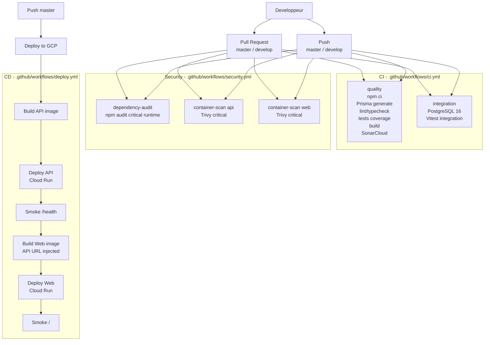

# CI/CD PouetPouet

> Socle mis a jour le 2026-06-13. Les workflows sont volontairement separes pour garder une lecture simple: qualite applicative, securite, puis deploiement.

## Vue d'ensemble

## Workflows

| Workflow         | Declencheurs                        | Role                                                                            | Bloquant                              |
| ---------------- | ----------------------------------- | ------------------------------------------------------------------------------- | ------------------------------------- |
| `ci.yml`         | PR, push `master`/`develop`, manuel | Feedback developpeur: lint, typecheck, tests, build, integration DB, SonarCloud | Oui                                   |
| `security.yml`   | PR, push, lundi 03:18 UTC, manuel   | Audit dependances runtime et scan d'images Docker                               | Oui pour les vulnerabilites critiques |
| `deploy.yml`     | push `master`, manuel               | Build/push images Artifact Registry puis deploy Cloud Run API et Web            | Oui                                   |
| `dependabot.yml` | planifie par GitHub                 | PRs de mise a jour npm et GitHub Actions                                        | N/A                                   |

## Liaisons et dependances

| Liaison                       | Source                   | Cible                              | Detail                                                                  |
| ----------------------------- | ------------------------ | ---------------------------------- | ----------------------------------------------------------------------- |
| Coverage Vitest -> SonarCloud | job `quality`            | `sonar-project.properties`         | Rapports `apps/api/coverage/lcov.info` et `apps/web/coverage/lcov.info` |
| API -> PostgreSQL CI          | job `integration`        | service `postgres:16-alpine`       | `DATABASE_URL` locale au job GitHub Actions                             |
| API deploy -> Web build       | `deploy-api.outputs.url` | build args Next.js                 | `NEXT_PUBLIC_API_URL` et `NEXT_PUBLIC_SOCKET_URL`                       |
| Docker images -> Cloud Run    | Artifact Registry GCP    | `pouetpouet-api`, `pouetpouet-web` | Tags `${{ github.sha }}` et `latest` pousses explicitement              |
| Security -> GitHub            | Trivy                    | table de resultat dans le job      | Seuil initial: `CRITICAL`, `ignore-unfixed: true`                       |

## Configuration GitHub requise

### Secrets

| Secret               | Utilise par             | Role                                          |
| -------------------- | ----------------------- | --------------------------------------------- |
| `SONAR_TOKEN`        | `ci.yml` / `quality`    | Authentifie le scan SonarCloud                |
| `GCP_PROJECT_ID`     | `deploy.yml`            | Projet GCP et chemin Artifact Registry        |
| `GCP_SA_KEY`         | `deploy.yml`            | Authentification service account GCP          |
| `DOCKERHUB_USERNAME` | `deploy.yml`            | Login Docker Hub pour limiter les rate limits |
| `DOCKERHUB_TOKEN`    | `deploy.yml`            | Token Docker Hub                              |
| `SENTRY_DSN_API`     | `deploy.yml`            | DSN Sentry API injecte dans Cloud Run         |
| `SENTRY_DSN_WEB`     | `deploy.yml`            | DSN Sentry Web injecte au build Next.js       |

### Variables

| Variable             | Utilise par             | Exemple                                       |
| -------------------- | ----------------------- | --------------------------------------------- |
| `SONAR_PROJECT_KEY`  | `ci.yml` / `quality`    | `pouetpouet` ou la cle fournie par SonarCloud |
| `SONAR_ORGANIZATION` | `ci.yml` / `quality`    | Organisation SonarCloud publique              |

## Garde-fous DevSecOps en place

- `permissions: {}` par defaut sur les workflows, puis permissions minimales par job.
- `concurrency` sur CI, securite et deploy pour eviter les runs obsoletes ou deploys paralleles.
- `npm ci` pour les jobs qui installent les dependances; `npm audit` lit le lockfile sans installation prealable.
- Quality gate SonarCloud active via `sonar.qualitygate.wait=true`.
- Audit runtime bloque uniquement les vulnerabilites critiques pour ne pas rendre la CI rouge tant que `xlsx` n'a pas de correctif npm disponible.
- Trivy scanne les images API et Web en local avant deploiement.
- Smoke tests post-deploiement sur l'API (`/health`) et le Web (`/`).

## Points de vigilance

- `npm audit --omit=dev` remonte actuellement `xlsx` en haute severite sans correctif disponible. A traiter par remplacement de librairie ou mitigation applicative avant de rendre le seuil `high` bloquant.
- Les actions GitHub sont referencees par version majeure ou tag public lisible. Un durcissement ulterieur peut pinner les actions par SHA complet.
- SonarCloud ne scanne que si `SONAR_TOKEN`, `SONAR_PROJECT_KEY` et `SONAR_ORGANIZATION` sont configures.
- Les E2E Playwright ne sont pas encore branches dans la CI: ils necessitent une stack applicative complete et doivent etre ajoutes dans un workflow dedie pour rester lisibles.
